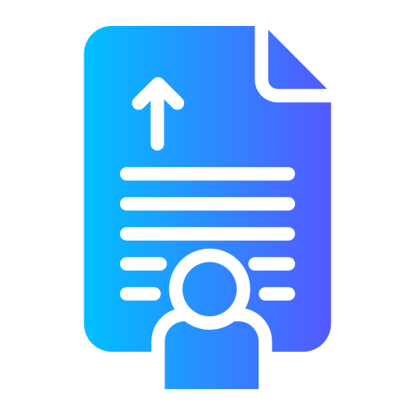

# One-Click Resume

**Attach your saved resume to any job application with a single click.**

---

## Features

- Save multiple resumes (PDF, DOC, DOCX) inside the browser
- Mark one resume as default and attach it with one click
- Floating widget appears only when an upload option is detected on the page
- Pick a different resume from the widget for a single upload without changing the default
- Draggable widget whose position is remembered across sessions
- Works on regular forms and dynamically created upload fields
- All data stays local — nothing is uploaded to any server

## Installation

1. Download or clone this repository.
2. Open `chrome://extensions` in Chrome.
3. Enable **Developer mode** (top right).
4. Click **Load unpacked** and select the project folder.

## Usage

1. Click the extension icon and add your resumes using **Add Resume**.
2. Set one resume as **Default**.
3. On any job application page, click the floating widget's main button to attach the default resume, or expand it to choose another resume for that application only.
4. Drag the widget anywhere you like, or close it for the current page.

## Supported Websites

Works generically with any site that uses a standard or dynamically created upload control, including LinkedIn Easy Apply, Google Forms, Workday, Greenhouse, and common ATS portals.

## Privacy

Resumes are stored only in your browser's local storage. The extension has no network access, and websites never receive anything except the file you explicitly attach. Uninstalling removes all stored data.

## Roadmap

- Rename resumes from the manager
- Per-site default resume overrides
- Cover letter support

---

Built for faster job applications.
